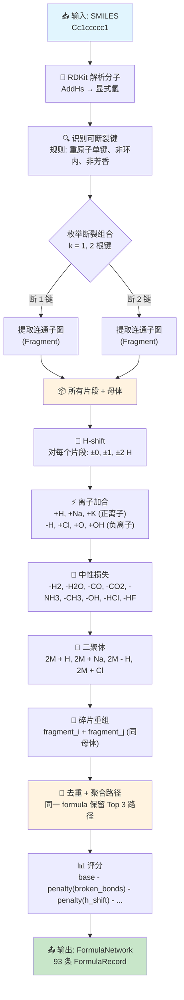
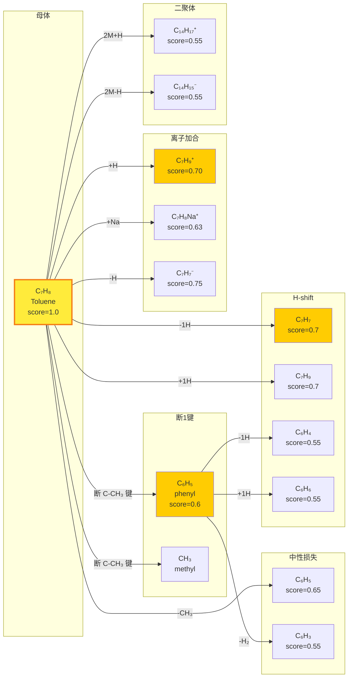
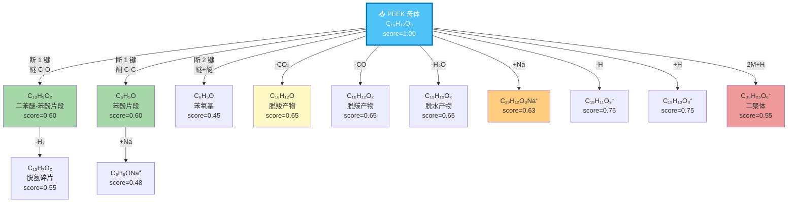

# TOF-SIMS 分子式网络生成算法流程

> 以 Toluene (甲苯, C₇H₈) 为例说明算法如何从一个 SMILES 产生碎片网络。

## 算法总流程



## Toluene 碎片生成示例



## 实际数据流（Toluene → 93 条记录）

```
SMILES: Cc1ccccc1
    │
    ▼
RDKit: C₇H₈ (15 atoms: 7C + 8H)
    │
    ▼
可断裂键: 1 根 (C-CH₃, 非芳香单键)
    │  (芳香键、环内键 默认不切)
    ▼
断 1 键 → 2 个片段: [C₆H₅], [CH₃]
    │  (min_heavy_atoms≥2 → CH₃ 被丢弃)
    ▼
对母体+片段 应用规则:
    ├─ H-shift (±2):    母体×4 + 片段×4  = 8 种
    ├─ 离子加合 ×6:     母体×6 + 片段×6  = 12 种 × H-shift
    ├─ 中性损失 ×9:     母体×9 + 片段×9  = 18 种 × H-shift
    ├─ 二聚体 ×2:       2M+H, 2M-H        = 2 种
    └─ 碎片重组:        无 (仅1个有效片段)
    ▼
去重前: ~200 条
去重后: 93 条 (保留最高分路径)
    │
    ▼
按 score 排序:
    1.00  parent        C₇H₈  M
    0.75  adduct        C₇H₇  M | -H
    0.75  adduct        C₇H₉  M | H
    0.70  h_shift       C₇H₇  M | H shift -1
    0.70  h_shift       C₇H₉  M | H shift +1
    0.65  neutral_loss  C₆H₅  M | -CH₃
    ...
```

## PEEK 聚合物碎片生成示例

> PEEK (聚醚醚酮) 是典型芳香工程塑料，重复单元含 3 个苯环 + 2 个醚键 + 1 个酮基。
> 相比 Toluene 只有 1 根可断裂键（93 条记录），PEEK 有 **多根可断裂键**，产生 **646 条记录，449 个唯分子式**。

### PEEK 结构概览

```
SMILES: O=C(c1ccc(Oc2ccc(O)cc2)cc1)c1ccc(O)cc1
重复单元:  -[O-Ph-O-Ph-C(=O)-Ph]-   (C₁₉H₁₂O₃，不含端基H)

结构展开:
    HO-Ph-O-Ph-C(=O)-Ph-OH
      ↑      ↑       ↑
    酚羟基  醚键    酮基

可断裂键 (重原子单键，非芳香，非环内): 共 ~8 根
    ├─ 2根 C-O 醚键 (Ph-O-Ph)          → 产生芳香醚碎片
    ├─ 2根 C-O 酚羟基键 (Ph-OH)        → 产生脱羟基碎片
    ├─ 1根 C-C 酮基键 (Ph-C(=O)-Ph)    → 产生苯甲酰基碎片
    └─ 3根 C-OH 键 (酚端基)             → 产生苯氧基碎片
```

### PEEK 碎片生成流程图



### PEEK 实际数据流（646 条记录）

```
SMILES: O=C(c1ccc(Oc2ccc(O)cc2)cc1)c1ccc(O)cc1
    │
    ▼
RDKit: C₁₉H₁₄O₄ (37 atoms: 19C + 14H + 4O, 含显式H)
    │
    ▼
可断裂键: 8 根
    ├─ 4根 C-O 醚/酚键 (Ph-O-Ph, Ph-OH)
    ├─ 1根 C-C 酮键 (Ph-C(=O))
    └─ 3根 C-OH 酚键
    (芳香C-C和环内键默认不切)
    │
    ▼
断 1 键: C(8,1) = 8 种组合  →  max 16 个片段
断 2 键: C(8,2) = 28 种组合 →  max 84 个片段
    │  min_heavy_atoms≥2 → 过滤极小碎片
    │  实际有效片段: 16 个 (去重后)
    ▼
对母体 + 16个片段 (共17个base) 应用规则:
    │
    ├─ H-shift (±2H):  17×5 = 85 种 (部分因H<0被丢弃)
    │
    ├─ 离子加合 ×6:    85×6 = 510 种 (部分加合后元素不足被丢弃)
    │   正离子: +H, +Na, +K
    │   负离子: -H, +Cl, +O, +OH
    │
    ├─ 中性损失 ×9:    85×9 = 765 种 (部分因元素不足被丢弃)
    │   -H₂, -H₂O, -CO, -CO₂, -NH₃, -CH₃, -OH, -HCl, -HF
    │   注意: PEEK含N→NH₃损失不可用, 含S→HCl/HF不可用
    │
    ├─ 二聚体 ×4:      2M+H, 2M+Na, 2M-H, 2M+Cl = 4 种
    │
    └─ 碎片重组 ×100:   16个片段两两组合 → C(16,2) = 120 种
        (实际受 max_recombined_fragments=2 和 max_fragments_for_recombination=100 限制)
    │
    ▼
去重前: ~1500 条
去重后: 646 条 (同 formula+ion_mode+generation_type 保留最高分)
    │  449 个唯分子式
    ▼
按 generation_type 分布:
    adduct:        379 (58.7%)  ← 离子加合物占多数
    neutral_loss:  188 (29.1%)  ← 中性损失碎片
    h_shift:        58 (9.0%)   ← 纯H转移
    fragment:       16 (2.5%)   ← 直接断裂（未加H-shift）
    dimer:           4 (0.6%)   ← 二聚体
    parent:          1 (0.2%)   ← 母体

按 broken_bonds 分布:
    1键断裂: 328 (50.8%)
    2键断裂: 252 (39.0%)
    0键断裂:  66 (10.2%)  ← H-shift/adduct/neutral_loss on parent
    │
    ▼
Top 10 最高分记录:
    1.00  parent        C₁₉H₁₂O₃  M
    0.75  adduct        C₁₉H₁₁O₃  M | -H
    0.75  adduct        C₁₉H₁₃O₃  M | H
    0.70  h_shift       C₁₉H₁₁O₃  M | H shift -1
    0.70  h_shift       C₁₉H₁₃O₃  M | H shift +1
    0.65  neutral_loss  C₁₈H₁₂O   M | -CO₂  (脱羧)
    0.65  neutral_loss  C₁₈H₁₂O₂  M | -CO   (脱羰)
    0.65  neutral_loss  C₁₉H₁₀O₂  M | -H₂O  (脱水)
    0.63  adduct        C₁₉H₁₂O₃Na M | Na   (钠加合物)
    0.60  fragment      C₁₃H₉O₂   break 1 bond(s)  (醚键断裂)
```

### Toluene vs PEEK 对比

| 维度 | Toluene (小分子) | PEEK (聚合物) |
|------|-----------------|---------------|
| SMILES | `Cc1ccccc1` | `O=C(c1ccc(Oc2ccc(O)cc2)cc1)c1ccc(O)cc1` |
| 重原子 | 7 | 23 |
| 可断裂键 | 1 (C-CH₃) | 8 (4醚+1酮+3酚) |
| 有效片段 | 1 | 16 |
| 断1键组合 | C(1,1)=1 | C(8,1)=8 |
| 断2键组合 | C(1,2)=0 | C(8,2)=28 |
| 生成记录数 | **93** | **646** |
| 唯分子式 | ~70 | **449** |
| 主要类型 | h_shift + adduct | adduct (58.7%) + neutral_loss (29.1%) |
| 碎片重组 | 无 (仅1个片段) | 有 (16个片段 → 120种组合) |

> **启示**: 聚合物重复单元越大，可断裂键越多，组合爆炸风险越高。PEEK 的 8 根键在 k=2 时产生 28 种组合，恰好在可控范围内。
> 但 PI (Kapton, 41 重原子) 的断键组合可达数百种，需 `max_generated_formulas_per_compound=20000` 兜底。

## 关键限制参数

| 参数 | 值 | 作用 |
|------|-----|------|
| max_bond_breaks | 2 | 最多断 2 根键，防止组合爆炸 |
| min_heavy_atoms_per_fragment | 2 | 丢弃过小片段（如单个 CH₃） |
| allow_ring_bond_break | false | 不切环内键 |
| allow_aromatic_bond_break | false | 不切芳香键 |
| max_generated_formulas_per_compound | 20000 | 全局上限 |
| h_shift_range | [-2, -1, 0, 1, 2] | H 转移幅度 |
| max_recombined_fragments | 2 | 最多 2 个片段重组 |

## 不同聚合物的预期行为

| 类型 | 材料 | 重原子 | 预期碎片特征 |
|------|------|--------|-------------|
| 小分子 | Toluene | 7 | ~93 条 |
| 氟聚合物 | PTFE, PVDF, ETFE, FEP, PFA | 4-14 | C-F 键断裂，大量含 F 碎片 |
| 工程塑料 | PEEK, PEI, PPS, PEN, PET | 8-41 | 芳香醚/酯/硫醚断裂 |
| 含 Si | PDMS | 8 | Si-O 键易断裂，特征 Si(CH₃)₂ 碎片 |
| 聚甲醛 | POMC, POMH | 3 | O-CH₂ 主链断裂，产生甲醛相关碎片 |
| 芳纶 | Nomex | 20 | 酰胺键断裂，芳香碎片 |
| 聚酰亚胺 | PI (Kapton) | 41 | 可能超过 20000 上限（需注意） |
