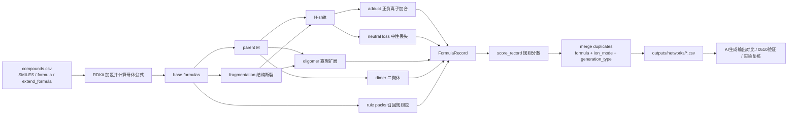

# TOF-SIMS Formula Network 算法路线图

生成日期：2026-06-24

> 用途：这份路线图用于向实验人员解释当前 formula network 如何生成候选碎片/离子公式，以及哪些环节需要实验经验帮助校准。

## 核心定位

当前算法不是离子轰击动力学模拟，也不预测峰强。它做的是：

```text
材料结构近似模型
  -> 生成可解释候选分子式 network
  -> 与 AI生成标注输出 / 谱图峰做交叉检查
  -> 找出可信候选、通用峰、规则缺口和背景峰
```

因此，`network 命中` 的含义是：

```text
该公式能被当前结构规则解释
```

不是：

```text
该峰已被最终化学确认
```

## 算法总路线



## 1. 输入层

| 输入 | 当前作用 | 需要注意 |
|---|---|---|
| `compound_id` | network 来源材料 ID | 直接影响同材料匹配 |
| `name` | 报告展示 | 不参与化学规则 |
| `smiles` | RDKit 结构来源 | 聚合物多为重复单元/短链近似 |
| `formula` | 人工母体公式，优先级高于 RDKit 公式 | 若错误会影响整个 network |
| `extend_formula` | 寡聚扩展重复单元 | 适合聚合物 repeat unit 近似 |
| `group/notes` | 当前主要作为备注 | 后续可用于材料类别规则 |

实验人员可帮助确认：

- SMILES 是否代表真实重复单元。
- `formula` 是否应覆盖 RDKit 计算结果。
- 复合材料是否需要 matrix / filler 拆分。

## 2. 母体公式 parent

每个材料先生成一条母体记录：

| 字段 | 值 |
|---|---|
| `generation_type` | `parent` |
| `ion_mode` | `neutral` |
| `path` | `M` |
| 初始分数 | `base_parent = 1.0` |

实验讨论点：

- 对聚合物而言，母体公式是重复单元还是短链模型？
- 是否需要为某些材料建立多个代表结构？

## 3. 结构断裂 fragmentation

当前实现位置：`fragmentation.py`

当前默认规则：

| 规则 | 当前配置 |
|---|---|
| 最多断键数 | `max_bond_breaks = 2` |
| 最小重原子数 | `min_heavy_atoms_per_fragment = 2` |
| 是否切环内键 | 默认不切 |
| 是否切芳香键 | 默认不切 |
| 可断键类型 | 重原子-重原子单键 |

当前 fragmentation 做的是：

```text
枚举可断裂键组合 -> RDKit 切键 -> 取每个连通片段的元素计数
```

重要边界：

- 它是结构片段公式，不是完整反应机理。
- 不模拟自由基稳定、重排、表面反应、补氢过程。
- 补氢/脱氢由后续 H-shift 近似处理。

实验人员可帮助判断：

- 哪些键在 TOF-SIMS 中更容易断。
- 是否允许切某些芳香键/环键。
- 哪些 fragment 是合理候选，哪些太宽。

## 4. H-shift

当前实现位置：`ion_rules.py`

当前配置：

```text
h_shift_range = [-2, -1, 0, 1, 2]
```

规则含义：

```text
base formula -> H 数加减 0/1/2
```

边界：

- H 数不能为负。
- `shift = 0` 保留原始 generation type。
- `shift != 0` 记为 `h_shift`。

实验人员可帮助判断：

- 是否所有材料都应允许 ±2H。
- 含氟、含硫、含氮材料是否需要不同范围。
- H-shift 是否应与极性或官能团绑定。

## 5. Adduct 正负离子加合

当前正离子加合：

```text
H, Na, K
```

当前负离子规则：

```text
-H, Cl, O, OH
```

输出：

| 字段 | 正离子 | 负离子 |
|---|---|---|
| `generation_type` | `adduct` | `adduct` |
| `ion_mode` | `positive` | `negative` |
| `charge` | `+1` | `-1` |

重要边界：

- 当前只改分子式，不检查配位位置、电荷稳定性或官能团。
- `Cl/O/OH` 作为负离子公式启发式，不等于已验证反应路径。

实验人员可帮助判断：

- Na/K/Cs 等金属峰是否应作为材料证据或背景。
- 含氟材料常见负离子是否需要单独规则。
- 哪些加合规则应只对特定材料开启。

## 6. Neutral loss 中性丢失

当前 loss 列表：

```text
H2, H2O, CO, CO2, NH3, CH3, OH, HCl, HF
```

当前实现：

```text
从 H-shift 后公式中扣除 loss 分子式
```

重要边界：

- 只做分子式扣减。
- 不检查结构里是否真的有对应官能团。
- 不检查 loss 的局部反应路径。

实验人员可帮助判断：

- 哪些 loss 是常见且可信的。
- 哪些 loss 需要官能团条件。
- 哪些 loss 过宽，应降权或限制材料类别。

## 7. Oligomer 寡聚扩展

触发条件：

```text
compounds.csv 中存在 extend_formula
```

当前配置：

| 参数 | 值 |
|---|---|
| `max_extend` | 12 |
| `max_mass` | 2000 |
| `penalty_per_extend` | 0.08 |

规则：

```text
base + n × extend_formula
```

实验人员可帮助判断：

- 哪些材料适合做寡聚扩展。
- 最大聚合度和质量上限是否合理。
- 寡聚峰是否应按谱图范围或材料类别限制。

## 8. Dimer 二聚体

当前生成：

```text
2M + H
2M + Na
2M - H
2M + Cl
```

边界：

- 只对 parent 做二聚体。
- 当前是启发式候选，不代表二聚过程真实发生。

实验人员可帮助判断：

- 哪些材料常见二聚峰。
- 二聚体是否应默认开启。
- Na/Cl 二聚体是否容易造成假阳性。

## 9. Rule packs 召回规则包

这些规则用于补足人工标注缺口，分数较低，应理解为召回候选。

| 规则包 | 当前材料 | 作用 | 典型风险 |
|---|---|---|---|
| `carbon_cluster` | COC, EVA, PET, POMC, POMH | 补碳簇/含氧碳簇 | 容易生成通用峰 |
| `siloxane_fragment` | PDMS | 补 Si/C/H/O 硅氧烷碎片 | 公式空间较宽 |
| `external_adduct` | POMC, POMH, EVA | 补 Na/K/Cs/Na2O/HNa2O 外部加合 | 可能混入背景/盐峰 |

实验人员可帮助判断：

- 哪些召回公式可作为材料证据。
- 哪些只应作为弱候选。
- 是否需要为含氟、芳香、含硫/含氮材料新增 rule pack。

## 10. Scoring 规则分数

当前 `score_record()` 不是概率模型，而是规则可信度启发式。

基础分：

| 类型 | 分数 |
|---|---:|
| parent | 1.00 |
| fragment | 0.75 |
| carbon_cluster | 0.22 |
| siloxane_fragment | 0.28 |
| external_adduct | 0.25 |

扣分项：

| 扣分项 | 含义 |
|---|---|
| `penalty_per_broken_bond` | 断键越多越低 |
| `penalty_per_h_shift` | H-shift 越大越低 |
| `penalty_neutral_loss` | loss 越多越低 |
| `penalty_non_h_adduct` | 非 H/-H 加合扣分 |
| `penalty_dimer` | 二聚体扣分 |
| `penalty_per_extend` | 寡聚扩展次数越多越低 |

实验人员可帮助判断：

- parent / fragment / adduct / loss 的相对可信度是否符合经验。
- 通用峰是否需要额外降权。
- 背景峰是否应单独排除，而不是只靠扣分。

## 11. 去重与输出

去重键：

```text
formula + ion_mode + generation_type
```

如果重复：

- 保留分数更高的记录。
- 路径会合并一部分，用于追溯来源。

输出：

```text
outputs/networks/<compound>.csv
outputs/networks/<compound>.json
```

每条记录包含：

```text
formula, exact_mass, ion_mode, charge, generation_type, path, score
```

## 12. 与 AI生成输出对比

当前对比方式有三类：

| 对比 | 文件 | 含义 |
|---|---|---|
| 朴素前十峰归属 | `rf_top10_plain_network_presence_excel.tsv` | 不评分，只看 AI生成前十峰公式是否在 network 出现 |
| network 筛选前十峰 | `rf_network_screened_top10_peaks_excel.tsv` | 综合结构支持、材料特异性、AI生成分数、rank 和峰强 |
| A/B 级候选公式 | `rf_network_screened_formulas.csv` | 用于人工复核和规则回灌 |

边界：

- AI生成候选不是最终真值。
- network 解释不是唯一归属。
- A/B 级只是复核优先级。

## 13. 对实验人员的讲解重点

建议用一句话概括：

```text
AI生成输出负责给出候选，formula network 负责检查这些候选是否能被材料结构规则解释；实验人员负责判断哪些规则和候选符合真实 TOF-SIMS 经验。
```

讲解时建议按这个顺序：

1. 先讲输入：结构模型、AI生成输出、谱图。
2. 再讲 network 如何扩展：parent、fragment、H-shift、adduct、loss、oligomer、dimer、rule packs。
3. 再讲分数：它是规则可信度，不是概率。
4. 再讲对比：AI生成前十峰、network 筛选前十峰、A/B 级候选。
5. 最后请实验人员标注：保留、降权、背景、删除、不确定。

## 14. 当前最需要实验帮助校准的地方

1. 是否允许切芳香键/环键，或只允许某些材料切。
2. H-shift 范围是否应按材料类型调整。
3. Na/K/Cs/Cl/O/OH 加合哪些应作为背景降权。
4. H2O/CO/CO2/HF/HCl 等 loss 是否需要官能团约束。
5. 复合材料中的玻纤/无机相如何进入 network。
6. 通用碳氢小碎片如何降权。
7. PAI、PBI、PCTFE 的结构输入如何补全。
