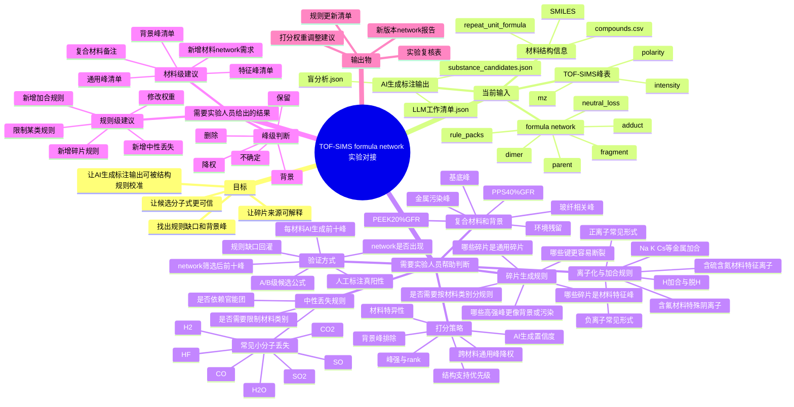

# TOF-SIMS Formula Network 实验对接思维导图

生成日期：2026-06-23

> 术语说明：本文中的 `RF_output` 仅指当前文件夹历史命名；实际含义应理解为“实验室提供的 AI 生成标注输出”，不是 Random Forest。

## 思维导图

如果在 Obsidian 中使用，建议优先打开更大的 Canvas 版本：

- `TOF-SIMS_formula_network_lab_collaboration_canvas_2026-06-24.canvas`

## 对接时建议给实验人员看的表

| 表格 | 文件 | 用途 |
|---|---|---|
| AI生成原始前十峰朴素归属 | `outputs/summary/rf_network_comparison/rf_top10_plain_network_presence_excel.tsv` | 不引入评分，只看 AI 生成前十峰在 network 中是否出现、归属于哪些材料。 |
| network筛选后前十峰 | `outputs/summary/rf_network_comparison/rf_network_screened_top10_peaks_excel.tsv` | 给出结构支持、材料特异性和 AI 生成证据综合后的优先复核峰。 |
| A/B级候选公式 | `outputs/summary/rf_network_comparison/rf_network_screened_formulas.csv` | 适合汇总哪些公式可作为规则回灌候选。 |
| 材料级汇总 | `outputs/summary/rf_network_comparison/rf_network_summary_by_material.csv` | 看每个材料的 network 覆盖情况和缺口大小。 |

## 给实验人员的复核问题清单

| 主题 | 希望实验人员判断的问题 | 我们如何使用反馈 |
|---|---|---|
| 碎片是否合理 | 某个候选公式是否可能来自该材料主链或侧基？ | 保留或新增 fragment/rule_pack 规则。 |
| 峰是否特征 | 该峰能否作为材料区分证据？是否在同类材料中常见？ | 调整材料特异性权重和跨材料降权。 |
| 极性是否合理 | network 有公式但极性不匹配时，正/负离子形式是否应该补充？ | 更新 ion_rules 和 polarity 规则。 |
| 中性丢失是否合理 | 某些 loss 是否需要官能团条件限制？ | 给 neutral_loss 增加结构上下文限制。 |
| 背景/污染峰 | 金属、盐、基底、环境残留峰是否应从材料证据中排除？ | 建立背景峰表或污染元素降权表。 |
| 复合材料 | GFR 材料中哪些峰来自树脂，哪些可能来自玻纤？ | 给 PEEK20%GFR、PPS40%GFR 加复合材料标记和解释策略。 |
| 打分权重 | 当前排序是否符合实验直觉？哪些峰排得过高或过低？ | 调整 network_screen_score 的结构支持、特异性、AI证据和峰强权重。 |

## 内容审核结论

当前内容总体可用于实验对接，但需要明确以下边界：

1. `AI生成标注输出` 是算法输出，不是最终化学事实。
2. `network 命中` 只表示该公式能被当前结构规则解释，不代表唯一归属。
3. `A/B 级` 是工程筛选优先级，不是最终定性标签。
4. 文中“特征峰”应理解为“候选特征峰，待实验确认”。
5. `PEEK20%GFR`、`PPS40%GFR` 是复合材料，当前 network 主要代表树脂基体，玻纤相需要单独讨论。
6. `PAI`、`PBI`、`PCTFE` 当前没有 network，不能用同材料 network 口径筛选，只能作为新增建库需求。

## 建议的会议流程

1. 先看每个材料的 AI 生成原始前十峰，确认哪些是明显背景或通用峰。
2. 再看 network 筛选后前十峰，确认是否更接近材料特征峰。
3. 对每个材料标出 3 类峰：材料特征峰、通用但可辅助峰、应排除峰。
4. 对 `formula_only_mode_gap` 的峰单独讨论极性规则是否需要补充。
5. 会后把反馈整理成规则更新清单，再进入下一版 network 规则和打分权重调整。

## 当前最希望实验人员优先帮助的点

1. 含氟材料：确认 `CFx`、`CxFy`、`CxHyFzO` 系列哪些是材料特征，哪些只是含氟通用峰。
2. 芳香聚合物：确认 `C10H6`、`C11H6O`、`C19H13O3/O4` 等大碎片是否合理。
3. 含 N/S 材料：确认 `CNO`、`CN`、`C6H4N`、`C6H5S2` 等是否应提升权重。
4. 金属/盐/背景：确认 `Na`、`K`、`Cs`、`Ca`、`Cl` 等在当前测试条件下应作为背景还是材料相关证据。
5. PAI、PBI、PCTFE：这些材料当前没有 network，是否可以提供 SMILES/repeat unit 或确认可用结构来源。
